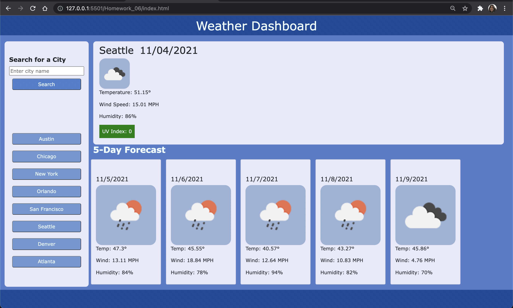

# Weather Dashboard

# Objectives 
- make a webpage to see the weather outlook for multiple cities 
- have a weather dashboard with form inputs 
- be able to search for a city and it's weather 
- see the current and future weather conditions for that city 
- the city is added to search history 
- weather conditions include: city name, the date, an icon representation of weather conditions, the temperature, the humidity, the wind speed, and the UV index 
- UV index needs to change color to indicate whether the conditions are favorable, moderate, or severe 
-resource for UV index [epa.gov](https://www.epa.gov/sunsafety/uv-index-scale-0)
- Present with a 5-day forecast that displays the date, icon representation of weather conditions, the temperature, the wind speed and humidity 
- when I click on a City in the Search history, I am presented with the current and future conditions for that city 

#Link to Webpage 
Here is the link to the [Weather Dashboard Webpage](https://fiona1nicdao.github.io/weather/)

 ## License 
  This project is licensed under the [MIT License](https://opensource.org/licenses/MIT).
## Technologies Used:
Javascript, CSS, HTML, OpenWeatherMap [API](https://openweathermap.org/api) 

#Preview

 ## Questions
  For any further assistance, you may contact me at:
  * Github: [fiona1nicdao](<https://github.com/fiona1nicdao>)
